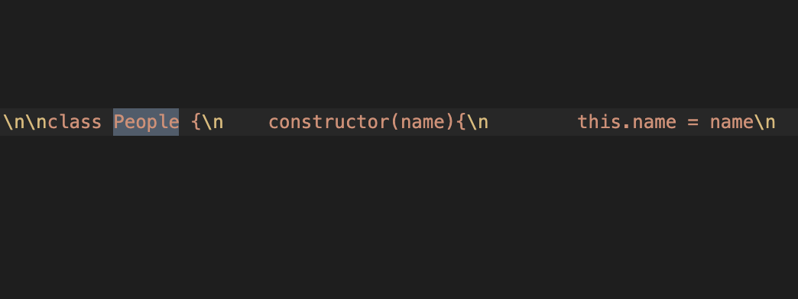
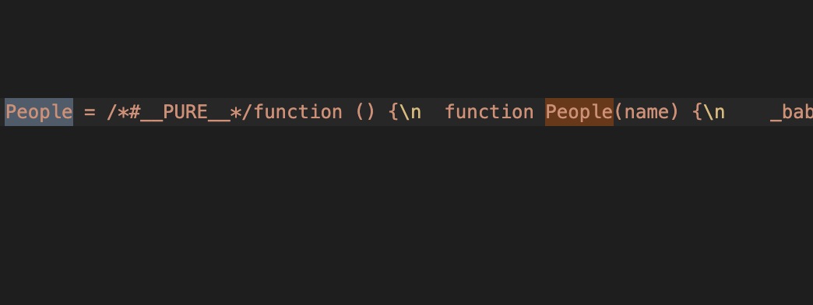
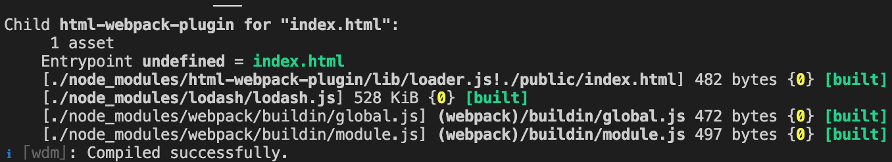
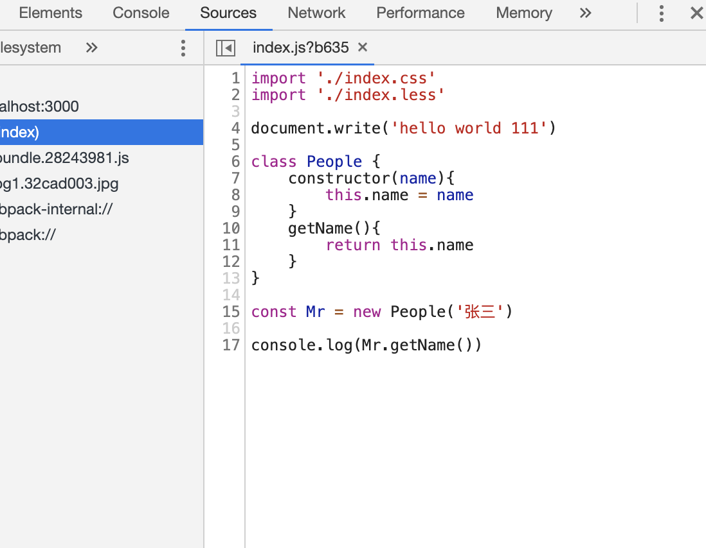

### webpack配置（1）

---

- ##### 初始化项目

   ```markdown
    npm init -y
   ```

- ##### 安装webpack

   ```
   npm i -D webpack webpack-cli
   ```

   ###### 本文webpack版本号	`"webpack": "^4.42.0"`	`"webpack-cli": "^3.3.11"`

- ##### 根目录新建src/index.js文件

   ```javascript
   //index.js
   document.write('hello world')
   ```

   

- ##### 根目录新建webpack.config.js文件

   ```javascript
   //webpack.config.js
   const path = require('path')
   
   module.exports = {
       mode:'development',//配置打包环境，‘development’    ‘production’
       entry:'./src/index.js',//入口文件
       output:{//输出文件
           path:path.resolve(__dirname,'dist'),
           filename:'bundle.[hash:8].js',//hash后缀，避免缓存问题
           publicPath:'/'//通常为CDN地址
       }
   }
   ```

   

- ##### 输入 `npx webpack`,进行初次打包，生成dist文件夹，其中bundle.js为打包后文件

- ##### 配置html文件，自动引入打包后文件

   - ###### 使用 html-webpack-plugin 插件

   - `npm i -D html-webpack-plugin`

   - ###### 新建 public/index.html文件

      ```javascript
      <!DOCTYPE html>
      <html lang="en">
      <head>
          <meta charset="UTF-8">
          <meta name="viewport" content="width=device-width, initial-scale=1.0">
          <title>Document</title>
      </head>
      <body>
          
      </body>
      </html>
      ```

   - ###### 修改webpack.config.js

      ```javascript
      const path = require('path')
      //引入html-webpack-plugin
      const HtmlWebpackPlugin = require('html-webpack-plugin')
      
      module.exports = {
          mode:'development',//配置打包环境，‘development’    ‘production’
          entry:'./src/index.js',//入口文件
          output:{//输出文件
              path:path.resolve(__dirname,'dist'),
              filename:'bundle.[hash:8].js',//hash后缀，避免缓存问题
          },
          plugins:[
              new HtmlWebpackPlugin({//使用html-webpack-plugin
                  template:'./public/index.html',
                  filename:'index.html',//打包后文件名
                  minify: {
                      removeAttributeQuotes: false, //是否删除属性的双引号
                      collapseWhitespace: false, //是否折叠空白
                  },
                  // hash: true //是否加上hash，默认是 false
              })
          ]
      }
      ```

      

   - ###### `npx webpack` 生成新文件index.html、bundle.js

      ```javascript
      //index.html
      <!DOCTYPE html>
      <html lang="en">
      <head>
          <meta charset="UTF-8">
          <meta name="viewport" content="width=device-width,initial-scale=1">
          <title>Document</title>
      </head>
      <body>
          
      <script type="text/javascript" src="/bundle.cc124ed8.js"></script></body>
      </html>
      ```

- ##### 每次打包均产生新的js文件处理

   - ###### 安装 `clean-webpack-plugin`

      ```javascript
      npm i -D clean-webpack-plugin
      ```

   - ###### webpack.config.js中使用

      ```javascript
      const { CleanWebpackPlugin } = require('clean-webpack-plugin');
      
      new CleanWebpackPlugin({
        cleanOnceBeforeBuildPatterns:['**/*', '!dll', '!dll/**'] //不删除dll目录下的文件
      }) 
      ```

   - ###### 重新打包

- ##### `style-loader` `css-loader` `less-loader` `sass-loader` 的使用

   - ###### webpack不能直接处理css文件，需要借助各种loader进行处理，同时需要postcss-loader处理浏览器的兼容性问题

   - ###### 安装依赖

      ```javascript
      npm i -D style-loader less-loader css-loader postcss-loader autoprefixer less
      ```

      

   - ###### 新建css文件，和less文件进行测试

      ```javascript
      //index.css
      body{
          padding: 0;
          margin: 0;
      }
      
      //index.less
      @color:gray;
      
      body{
          background: @color;
      }
      ```

      

   - ###### 设置webpack.config.js

      ```javascript
      module:{
        rules:[
          {
            test: /\.(le|c)ss$/,//匹配less或者css文件
            use: ['style-loader', 'css-loader', {
              loader: 'postcss-loader',
              options: {
                plugins: function () {
                  return [    //处理浏览器前缀问题
                    require('autoprefixer')({
                      "overrideBrowserslist": [
                        ">0.25%",
                        "not dead"
                      ]
                    })
                  ]
                }
              }
            }, 'less-loader'],
            exclude: /node_modules/ //不对node_modules中文件进行匹配
          },
        ]
      },
      ```

      

   - ###### 打包后，css样式引用成功

- ##### babel转义js版本

   - ###### index.js中输入es6语法,直接打包后并未进行转义

      ```javascript
      //index.js
      import './index.css'
      import './index.less'
      
      document.write('hello world')
      
      class People {
          constructor(name){
              this.name = name
          }
          getName(){
              return this.name
          }
      }
      
      const Mr = new People('张三')
      
      console.log(Mr.getName())
      ```

      

      

   - ###### 安装babel-loader

      `npm install babel-loader -D` 

      `npm install @babel/core @babel/preset-env @babel/plugin-transform-runtime -D`

      `npm install @babel/runtime @babel/runtime-corejs3` 

   - ###### 创建 .babelrc文件进行babel配置

      ```javascript
      {
          "presets": ["@babel/preset-env"],
          "plugins": [
              [
                  "@babel/plugin-transform-runtime",
                  {
                      "corejs": 3
                  }
              ]
          ]
      }
      
      ```

   - ###### webpack.config.js中进行配置

      ```javascript
      {
      	test:/\.js$/,
      	use:['babel-loader'],
      	exclude:/node_modules/
      }
      ```

   - ###### 重新打包，发现es6及更高级写法被转义

      

- ##### 在index.html中使用模版字符串

   - ###### 在public下新建template.js文件

      ```javascript
      module.exports = {
          development:{
              template:{
                  title:'development'
              }
          },
          production:{
              template:{
                  title:'production'
              }
          }
      }
      ```

    - ###### 安装 `cross-env`

      ```javascript
      npm i -D cross-env
      ```

      

   - ###### 设置package.json中代码

      ```javascript
      "scripts": {
          "test": "echo \"Error: no test specified\" && exit 1",
          "dev": "cross-env NODE_ENV=development webpack",
          "build": "cross-env NODE_ENV=production webpack"
      },
      ```
      
      - ###### webpack.config.js中根据环境进行使用

         ```javascript
         const isDev = process.env.NODE_ENV === 'development';
         const config = require('./public/template')[isDev ? 'development' : 'production'];
         
         ...
         
         new HtmlWebpackPlugin({
             template:'./public/index.html',
             filename:'index.html',//打包后文件名
             minify: {
             removeAttributeQuotes: false, //是否删除属性的双引号
             collapseWhitespace: false, //是否折叠空白
             },
             // hash: true //是否加上hash，默认是 false
             config: config.template
         }),
         ```

         

      - ###### 在index.html中进行使用，执行 `npm run dev`  `npm run build`  可发现title根据命令变化

         ```javascript
         <title><%= (htmlWebpackPlugin.options.config.title) %></title>
         ```


​      

- ##### 处理图片

   - ###### 安装 `url-loader` `file-loader`

      ```javascript
      npm i -D url-loader file-loader
      ```

   - ###### 配置webpack.config.js

      ```javascript
      {
          test:/\.(png|jpg|gif|jpeg|webp|svg|eot|ttf|woff|woff2)$/,
          use:[
          {
          loader:'url-loader',
          options:{
          limit:10240,
          esModule:false,
          name:'[name].[hash:8].[ext]'
          }
          }
          ],
          exclude:/node_modules/
      }
      ```

   - ###### 在index.less中引入文件

      ```javascript
      @color:gray;
      
      body{
          background: @color url('../assets/bg1.jpg') no-repeat;
      }
      ```

   - ###### 打包后，图片加载成功

      
   
- ##### 开发环境的热更新

   - ###### 安装 `webpack-dev-server`

      ```javascript
      npm install webpack-dev-server -D
      ```

      

   - ###### 设置package.json中代码

      ```javascript
      "scripts": {
          "test": "echo \"Error: no test specified\" && exit 1",
          "dev": "cross-env NODE_ENV=development webpack-dev-server",
          "build": "cross-env NODE_ENV=production webpack"
      },
      ```

   - ###### 此时执行 `npm run dev` 可开启本地环境，修改文件可实时更新至页面

      

   - ###### 配置devserver

      ```javascript
      //webpack.config.js
      devServer: {
          port: '3000', //默认是8080
          quiet: false, //默认不启用
          inline: true, //默认开启 inline 模式，如果设置为false,开启 iframe 模式
          stats: "errors-only", //终端仅打印 error
          overlay: false, //默认不启用
          clientLogLevel: "silent", //日志等级
          compress: true //是否启用 gzip 压缩
      },
      ```

- ##### 源代码映射

   - ###### webpack.config.js

      ```javascript
      devtool: 'cheap-module-eval-source-map', //开发环境下使用
      ```

   - ###### 可在开发模式中，通过Sources审查源代码

      

